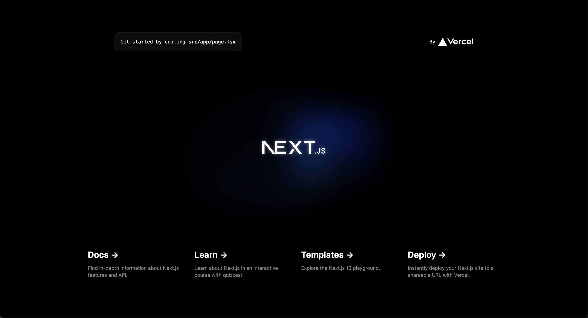

# Next.js-hands-on
---
### プロジェクトの作成
1. node, npmのバージョン確認
```shell
$ node -v
v20.2.0
```
```shell
$ npm -v
9.6.6
```
- バージョンが表示された
    - インストール済み
- 何も表示されない
    - インストールを行う

---
2. node, npmのインストール
```shell
$ brew install node
```
1.と同様にバージョンを確認し、表示されたら成功

---
3. Next.jsプロジェクトを作成
```shell
$ npx create-next-app@latest next-practice --typescript
```
- ESLintを使用するかきかれるので`Yes`を選択
```shell
? Would you like to use ESLint with this project? › No / Yes
```
- Tailwind CSSを使用するかきかれるのでお好みで選択
```shell
? Would you like to use Tailwind CSS with this project? › No / Yes
```
- `src/`ディレクトリを使用するかきかれるので`Yes`を選択
```shell
? Would you like to use `src/` directory with this project? › No / Yes
```

---
- App Routerを使うかきかれるので`No`を選択
```shell
? Use App Router (recommended)? › No / Yes
```
- デフォルトのimport aliasを変更するかきかれるので`No`を選択
```shell
? Would you like to customize the default import alias? › No / Yes
```
- 次のように表示されれば成功
```shell
Success! Created next-practice at 
```
- プロジェクトディレクトリに移動
```shell
$ cd next-practice
```

---
- サーバの起動
```shell
$ npm run dev
```
- Webブラウザからhttp://localhost:3000にアクセス
- このように表示されれば成功


---
### Next.jsにおけるルーティング
- 基本ルーティング
    - `pages`ディレクトリ内のファイル構成に応じてルーティングが生成される
    - `pages/hello.tsx`を作成
    ```typescript
    export default function Hello() {
        return (
            <main>
                <div>
                    <h1>Hello, World!</h1>
                    <p>こんにちは, 世界！</p>
                </div>
            </main>
        )
    }

    ```
    - `http://localhost:3000/hello`にアクセス

---
- ネストルーティング
    - `pages`ディレクトリ内に任意のディレクトリを作成・その中のファイル構成に応じてルーティングが生成される
    - `pages/member/watashi.tsx`を作成
    ```shell
    $ mkdir src/pages/member
    $ touch src/pages/member/watashi.tsx
    ```

---

- `pages/member/watashi.tsx`に記述
    ```typescript
    export default function ThisIsMe() {
        return (
            <main>
                <div>
                    <h1>これが私だ！！！！</h1>
                    <ul>
                        <li>名前: わたし</li>
                        <li>年齢: 3万2043歳</li>
                        <li>好きなこと: 昼寝</li>
                    </ul>
                </div>
            </main>
        )
    }
    ```
    

---

- `http://localhost:3000/member/watashi`にアクセス
- ディレクトリを指定すると自動的に`index.tsx`が参照される

---

- `pages/member/index.tsx`を作成
    ```typescript
    import Link from 'next/link'

    export default function Members() {
        return(
            <main>
                <div>
                    <h1>これはメンバー紹介のページです</h1>
                    <h2>メンバー一覧</h2>
                    <ul>
                        <li><Link href='/member/1'>1人目</Link></li>
                        <li><Link href='/member/2'>2人目</Link></li>
                        <li><Link href='/member/3'>3人目</Link></li>
                    </ul>
                </div>
            </main>
        )
    }
    ```

---
- ダイナミックルーティング
    - リスエストされたパスに応じてダイナミックにページを生成
    - 任意のディレクトリ直下にファイル名を`[]`で囲ったファイルを作成
    - 例)`pages/member/[memberId].tsx`を作成
    ```typescript
    import {useRouter} from 'next/router'

    export default function memberDetail() {
        const router = useRouter()
        const memberId = router.query.memberId
        return (
            <h1>This is about Member {memberId}</h1>
        )
    }
    ```
    - `http://localhost:3000/member/1`にアクセス
    - `http://localhost:3000/member/2`にアクセス

---

### コンポーネントの作成
- Component: 部品
- Componentを作成すると同じ部分を使い回すことができる
    - 例: ヘッダー・フッター・ナビゲーションバー
- Componentの保存場所を作成
    - `src/components`を作成

---

- ナビゲーションバーを作成してみる
    - `src/components/navigation`を作成
    - `src/components/navigation/index.tsx`を作成
    ```typescript
    import styles from './navigation.module.css'
    import Link from 'next/link'

    export default function Navbar() {
        return (
            <nav className={styles.nav}>
                <ul>
                    <li><Link href='/'>Home</Link></li>
                    <li><Link href='/about'>About</Link></li>
                </ul>
            </nav>
        )
    }
    ```

---

- `src/components/navigation/navigation.module.css`を作成
    ```typescript
    .nav {
        background-color: #666;
    }

    .nav ul {
        width: 90%;
        display: flex;
        list-style: none;
        margin: 0 auto;
        height: 50px;
    }

    .nav a {
        text-decoration: none;
        color: #fff;
        padding: 10px 20px 10px 0px;
        display: block;
        font-size: large;
    }

    .nav a:hover {
        color: #aaa;
    }

    @media screen and (max-width: 640px) {
        .nav {
            background-color: #0183a0;
            height: 150px;
        }

        .nav ul {
            flex-direction: column;
            padding: 0;
        }

        .nav li {
            border-bottom: solid 1px #fff;
        }
    }

    ```

---
- `src/pages/index.tsx`を変更
    ```typescript
    import Image from 'next/image'
    import Link from 'next/link'
    import { Inter } from 'next/font/google'
    import Navigation from '../components/navigation'

    const inter = Inter({ subsets: ['latin'] })

    export default function Home() {
    return (
        <div>
        <Navigation />
        <h1>ナビゲーションをつけてみた</h1>
        <main>
            <div>
            <h1>はじめてのNext.js！</h1>
            <p>こんにちは</p>
            <p>これはindex.tsx</p>
            <Link href='/member'>メンバーを見るにはこちら</Link>
            </div>
        </main>
        </div>
    )
    }

    ```

---

- メンバー一覧のページにはナビゲーションバーが表示されない...
    - `src/pages/member/index.tsx`にナビゲーションバーを呼び出してみよう
    - `import Navigation from '../../components/navigation'`でComponentの読み込み
    - `<Navigation></Navigation>`でComponentを表示
        - `<Navigation />`でも同じように表示される
        - `<Navigation />` == `<Navigation></Navigation>` (同値)

---
- src/pages/member/index.tsx`
    ```typescript
    import Link from 'next/link'
    import Navigation from '../../components/navigation'

    export default function Members() {
        return(
            <div>
                <Navigation />
                <main>
                    <div>
                        <h1>これはメンバー紹介のページです</h1>
                        <h2>メンバー一覧</h2>
                        <ul>
                            <li><Link href='/member/1'>1人目</Link></li>
                            <li><Link href='/member/2'>2人目</Link></li>
                            <li><Link href='/member/3'>3人目</Link></li>
                        </ul>
                    </div>
                </main>
            </div>
        )
    }
    ```
